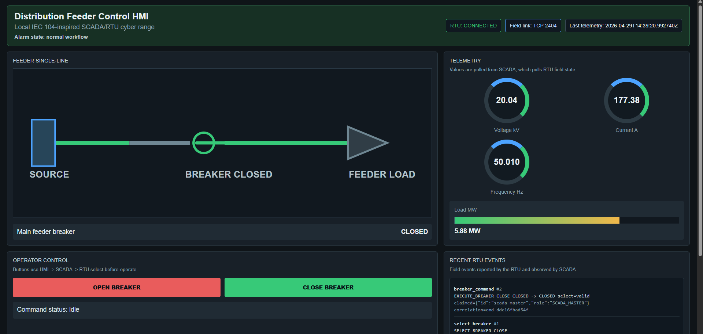
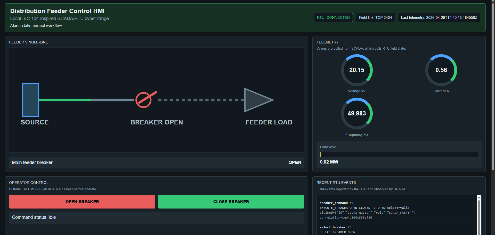
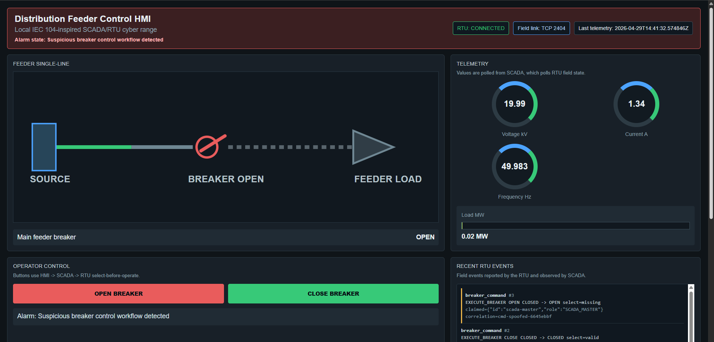
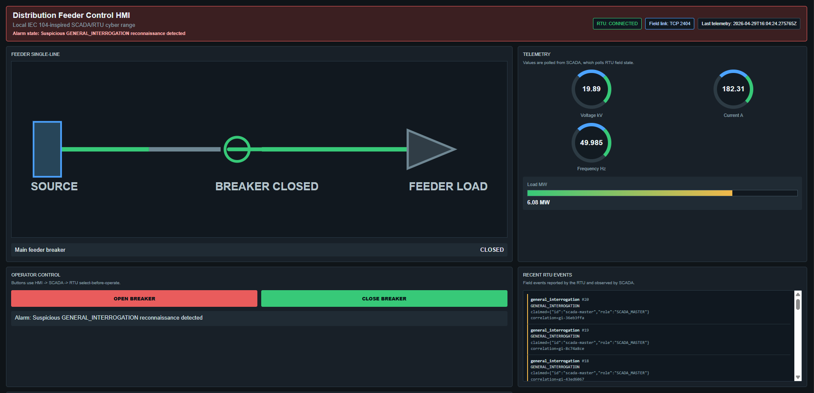

# Electric Utility OT Cyber Range: SCADA/RTU Offensive Security Lab

A software-only cyber range for SCADA command workflow, RTU field-state simulation, spoofed field-protocol control abuse, and OT detection engineering.

Phase 1 models a simplified distribution feeder control scenario for a local Docker lab. It focuses on breaker operation, RTU telemetry integrity, operator HMI visibility, field-device trust boundaries, and OT SOC-style detection evidence. The default attack bypasses the HMI/SCADA workflow, connects directly to the RTU field-protocol interface, spoofs SCADA identity, and triggers workflow/correlation detections.

This is an independent, software-only lab built to explore electric utility OT security concepts using synthetic components and local Docker services. Public electric-utility materials are referenced only as background context for sector-relevant themes such as smart grid digitalization, AMI, SCADA monitoring, field-device trust boundaries, and critical-infrastructure cybersecurity.

## Demo Screenshots

### Normal HMI Closed State



### Normal SCADA Open Command



### Spoofed Direct RTU Attack Detection



### Phase 2.1 GENERAL_INTERROGATION Reconnaissance Detection



## What This Demonstrates

| Area | Demonstrated Capability |
| --- | --- |
| Electric utility OT | Simulated distribution feeder, breaker state, RTU telemetry, and HMI visibility |
| SCADA workflow | HMI-to-SCADA control path with select-before-operate |
| RTU field state | Authoritative breaker and telemetry state owned by the RTU simulator |
| Offensive security | Direct field-protocol command abuse against the RTU |
| Attack realism | Spoofed SCADA identity instead of honest attacker self-identification |
| Detection engineering | Workflow, select-token, correlation, sequence, and field-interface detections |
| Evidence validation | Repeatable normal and attack validation with curated artifacts |

## Architecture

```text
Browser HMI -> HTTP/JSON -> HMI Backend -> HTTP/JSON -> SCADA Master
SCADA Master -> TCP JSON-lines -> RTU Simulator
Attacker -----------------------> TCP JSON-lines -> RTU Simulator
```

The field protocol is TCP JSON-lines: one JSON object per line over a raw TCP connection. The protocol includes IEC 60870-5-104-inspired concepts such as sequence values, cause of transmission, addressing fields, general interrogation style telemetry reads, and select-before-operate breaker control.

The RTU uses container port `2404` as an IEC 60870-5-104 reference only. This is an IEC 104-inspired educational protocol, not a standards-compliant IEC 60870-5-104 implementation.

## Quick Start

Start the lab:

```bash
docker compose up --build
```

Open the HMI:

```text
http://localhost:18081
```

Run the default spoofed direct RTU attack:

```bash
docker compose run --rm attacker python attacks/unauthorized_breaker_open.py
```

Run the Phase 2.1 GENERAL_INTERROGATION reconnaissance scenario:

```bash
docker compose run --rm attacker python attacks/general_interrogation_abuse.py --count 20 --delay 0.1
```

## Security Finding Modeled

**Finding:** Weak field-protocol command validation allows direct breaker operation outside the intended HMI/SCADA workflow.

**Root cause:** The simulated RTU accepts control messages without strongly verifying command origin, select-before-operate state, and SCADA command correlation.

**Attack path:** A direct TCP JSON-lines client connects to the RTU, spoofs SCADA identity, and sends `EXECUTE_BREAKER OPEN` without a valid select token or SCADA-issued correlation record.

**Impact:** The feeder breaker opens, downstream current/load drop near zero, the HMI alarm activates, and SCADA detects the breaker transition without matching operator workflow evidence.

**Mitigation direction:** Strong command authentication, strict select-before-operate enforcement, SCADA command correlation, replay protection, network segmentation, and event monitoring.

## Normal Workflow Demo

Normal operator control follows the intended path:

```text
HMI -> SCADA Master -> SELECT_BREAKER -> RTU returns select_token
HMI -> SCADA Master -> EXECUTE_BREAKER with select_token + correlation_id -> RTU
```

Expected normal behavior:

- Breaker open/close commands are issued through the SCADA Master.
- The RTU records a valid select-before-operate token.
- The SCADA Master has a local command correlation record.
- Normal command responses return `detections: []`.
- Critical workflow-bypass detections are absent.

## Spoofed Direct RTU Attack Demo

The default attack connects directly to the RTU field protocol interface and sends `EXECUTE_BREAKER OPEN`.

The attacker does not honestly identify as an attacker. It claims:

```json
{
  "source": {
    "id": "scada-master",
    "role": "SCADA_MASTER"
  }
}
```

The attack lacks:

- a valid `select_token`
- a valid SCADA-issued `correlation_id`
- normal HMI/SCADA workflow evidence

Because Phase 1 intentionally runs with `RTU_VULNERABLE_MODE=true`, the RTU detects the invalid workflow but still executes the breaker command.

Expected attack result:

- Breaker changes to `OPEN`.
- HMI single-line diagram updates.
- Current and load drop near zero.
- Alarm banner activates.
- RTU logs show the direct field-interface command.
- SCADA detections show workflow, correlation, and select-token failures.

The detection is not based on `source.role=ATTACKER`. The default attacker claims SCADA identity, and detection still fires because client-provided identity is treated as untrusted metadata.

## GENERAL_INTERROGATION Abuse Demo

Phase 2.1 adds one IEC 104-inspired reconnaissance scenario. A direct field-protocol client repeatedly sends `GENERAL_INTERROGATION` to enumerate synthetic RTU process state and point metadata.

The breaker state does not change. The HMI continues to show feeder state and telemetry, while the RTU and SCADA detections identify excessive or direct field-interface interrogation behavior.

The Phase 2.1 screenshot shows the breaker remaining `CLOSED` while the HMI displays GENERAL_INTERROGATION reconnaissance detections, distinguishing reconnaissance/enumeration from breaker-control impact.

Example:

```bash
docker compose run --rm attacker python attacks/general_interrogation_abuse.py --count 20 --delay 0.1
```

## Validated Evidence

| Evidence Set | Purpose | Validation Command |
| --- | --- | --- |
| `evidence/phase1-normal-scada-workflow/` | Proves normal HMI/SCADA select-before-operate does not trigger critical workflow-bypass detections | `make validate-normal-evidence` |
| `evidence/phase1-spoofed-direct-rtu-attack/` | Proves spoofed direct RTU control is detected despite claiming SCADA identity | `make validate-attack-evidence` |
| `evidence/phase2-general-interrogation-abuse/` | Proves repeated direct GENERAL_INTERROGATION is detected as reconnaissance/enumeration without changing breaker state | `make validate-general-interrogation-evidence` |

Generate and validate normal SCADA workflow evidence:

```bash
make evidence-normal
make validate-normal-evidence
```

Generate and validate spoofed direct RTU attack evidence:

```bash
make evidence-attack
make validate-attack-evidence
```

Generate and validate GENERAL_INTERROGATION abuse evidence:

```bash
make evidence-general-interrogation
make validate-general-interrogation-evidence
```

Curated evidence is stored under `evidence/`. Runtime logs under `logs/` are temporary and should be reset before validation.

If old runtime logs were created as root and cannot be removed by normal cleanup, run this one-time host cleanup:

```bash
sudo rm -f logs/rtu.jsonl logs/scada.jsonl logs/detections.jsonl
mkdir -p logs
touch logs/rtu.jsonl logs/scada.jsonl logs/detections.jsonl
chmod 666 logs/rtu.jsonl logs/scada.jsonl logs/detections.jsonl
```

## Useful Commands

```bash
make up
make down
make attack
make clean-logs
make evidence-normal
make evidence-attack
make evidence-general-interrogation
make test
```

## Public References And Context

These sources provide public context for electric utility digitalization, AMI, smart grid, power-system communication cybersecurity, and IEC 104/IEC 61850-adjacent concepts. The references are contextual anchors. They are not dependencies, datasets, endorsements, or implementation sources unless explicitly stated.

See [docs/electric-utility-context.md](docs/electric-utility-context.md) and [docs/references.md](docs/references.md).

## Limitations

- The field protocol is IEC 104-inspired, not standards-compliant IEC 60870-5-104.
- The RTU, SCADA Master, and HMI are simplified software services.
- There is no real PLC, RTU, protection relay, IED, smart meter, or hardware-in-the-loop system.
- Phase 1 does not include power-flow simulation, relay protection logic, or IEC 61850 messaging.
- Docker network peer data is used as an investigative hint, not strong identity.

## Scope And Safety Boundary

This project runs entirely inside a local Docker lab using synthetic services and telemetry. Do not use it against systems you do not own or have explicit authorization to test.

## Implemented Scope

Phase 1 includes:

- RTU simulator
- SCADA Master
- HMI-style browser dashboard
- attacker container
- TCP JSON-lines field protocol
- JSON logs
- basic RTU and SCADA detections
- curated evidence generation and validation
- focused tests

Phase 2.1 adds:

- `GENERAL_INTERROGATION` abuse attacker
- synthetic RTU point-summary response
- excessive/direct field-interface interrogation detections
- curated evidence generation and validation

Out of scope:

- IEC 61850, GOOSE, MMS
- AMI
- pandapower, OpenDSS
- fuzzing
- Suricata, Zeek, Wazuh, Sigma
- PostgreSQL
- React
- Kubernetes
- TLS/mTLS and real authentication
- real utility addresses or infrastructure
- packet replay against real networks

## Roadmap

Phase 2+ items are roadmap only and are not implemented in Phase 1:

- additional IEC 104-inspired protocol abuse scenarios
- telemetry replay and timestamp tampering scenarios
- physics-aware validation with a feeder model
- IEC 61850 digital substation simulation
- AMI smart meter simulator
- protocol fuzzing harness
- external detection-content formats
